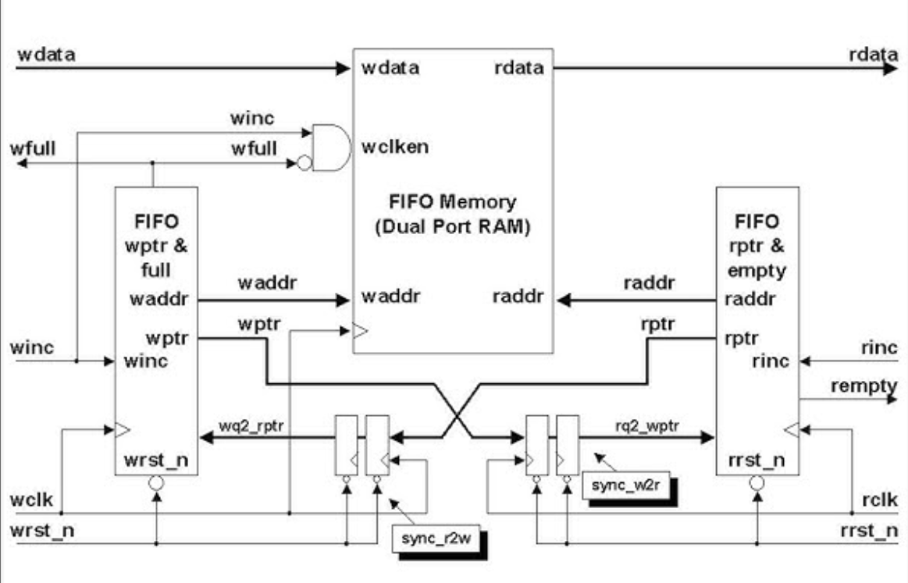

# Asynchronous FIFO

## Overview
This repository contains a synthesizable asynchronous FIFO implementation designed for safe data transfer between independent clock domains. The design follows CDC techniques using Gray-coded pointers and multi-stage synchronizers to ensure reliable full and empty detection across clock boundaries.
## Typical Asynchronous FIFO Block Diagram

## Interface
**Key signals**
- **Write domain**: `wclk`, `wrst_n`, `wen`, `wdata`, `wfull`
- **Read domain**: `rclk`, `rrst_n`, `ren`, `rdata`, `rempty`
## Clocks / Resets
- Independent write (`wclk`) and read (`rclk`) clocks.
- Active-low asynchronous resets (`wrst_n`, `rrst_n`) per clock domain.
- Local resets are synchronized internally to avoid reset-related CDC issues.
## Implementation
### Functional Description
#### Write Interface
- When `wen` is asserted and `wfull` is deasserted, `wdata` is captured on the rising edge of `wclk` and written into FIFO memory.
- Each successful write advances the write pointer.
- When the FIFO reaches maximum capacity, `wfull` is asserted to block further writes.
- Writes attempted while `wfull` is asserted are safely ignored.
#### Read Interface
- When `ren` is asserted and `rempty` is deasserted, data is read from FIFO memory and driven on `rdata` on the rising edge of `rclk`.
- Each successful read advances the read pointer.
- When no valid data is available, `rempty` is asserted.
- Reads attempted while `rempty` is asserted do not advance the read pointer, and `rdata` holds the last valid value.
#### Full and Empty Generation
- Independent read and write pointers are extended with an extra MSB to differentiate full and empty states.
- `rempty` is asserted when the local read pointer equals the synchronized write pointer (including MSB).
- `wfull` is asserted when the lower address bits of the local write pointer match the synchronized read pointer and the MSBs differ.

#### Clock Domain Crossing
- Read and write pointers are converted to Gray code before crossing clock domains.
- Pointers are synchronized using two-stage flip-flop synchronizers.
- Full and empty flags are generated using synchronized Gray-coded pointers.
## Submodules
- `fifo_mem` – Dual-port FIFO memory
- `sync_2stage` – Two-flip-flop CDC synchronizer
- `wptr_control` – Write pointer and full-flag logic
- `rptr_control` – Read pointer and empty-flag logic
## Synthesis
- WIP